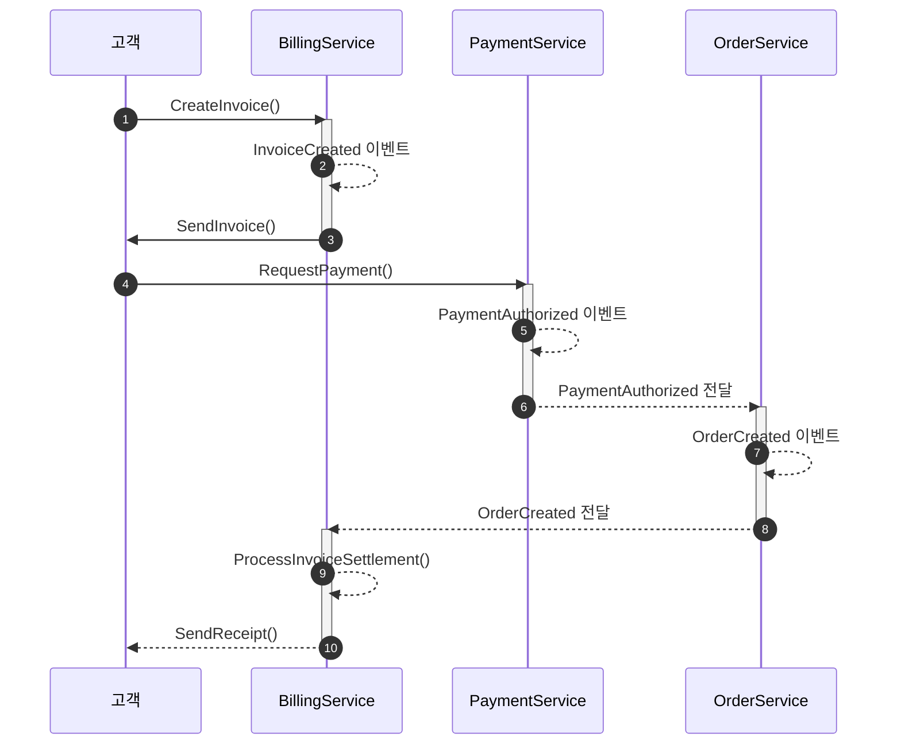
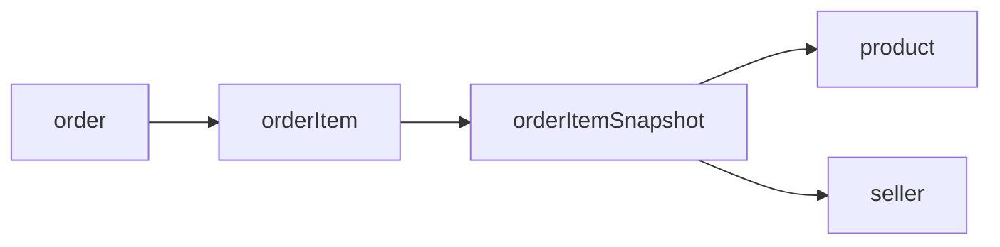

## 정산이란?

누가 무엇을 얼마나 거래를 했는가를 계산해서 이윤 관계를 정리하는 것을 말한다.

플랫폼은 셀러와 바이어가 거래 할 수 있은 공간을 제공하고 셀러는 플랫폼 위에서 바이어와 거래를 한다.

정산은 '플랫폼과 셀러사이에서 발생하는 거래의 이윤관계를 정리하는 것'을 말한다.

## Glossary

| 용어        | 의미                                                           |
|-----------|--------------------------------------------------------------|
| 원장        | 	거래내역을 기록한 원 장부                                              |
| 판매가       | 	판매할 때 상품 가격                                                 |
| 공급가       | 	상품의 원 공급가격                                                  |
| 세금, 부가가치세 | 상품(재화)의 거래나 서비스(용역)의 제공 과정에서 얻어지는 부가가치(이윤)에 대해서 과세하는 세금      |
| 과세        | 	부가가치세를 부과하는 세금형태                                            |
| 영세        | 	기본적으로 부가가치세를 부과해야 하지만, 수출등 세금 이중과세 적용 때문에 가치세를 0(zero)% 부가함 |
| 면세        | 	부가가치세 대상이 아닌 것                                              |
| 수수료       | 	플랫폼의 중개 보수금액                                                |
| 할인가       | 	프로모션(쿠폰, 할인) 금액                                             |
| 포인트 적용가   | 	주문에 적용된 포인트 적용금액                                            |
| 분담비율      | 	플랫폼과 셀러 사이에 프로모션  금액에 부담 비율                                 |
| 구매확정      | 	거래의 종료. 더 이상 환불 등이 발생하지 않는 상태                               |

| 한국어 개념 | 영어 용어                                | 설명                                             |
|--------|--------------------------------------|------------------------------------------------|
| 주문서    | Order                                | 고객이 서비스·제품 구매를 위해 제출하는 요청서 (상품·수량·가격 등 포함)     |
| 주문(행위) | Place Order                          | 고객이 주문서를 생성하는 액션                               |
| 주문 확인  | Order Confirmation                   | 시스템이 주문 접수 여부를 고객에게 알림                         |
| 청구서    | Invoice                              | 주문 또는 사용 내역을 바탕으로 발행되는 금액 청구서                  |
| 청구서 생성 | Create Invoice                       | Invoice 인스턴스를 생성하는 도메인 명령                      |
| 청구서 발송 | Send Invoice                         | 고객에게 Invoice를 전송(이메일·API 등)                    |
| 결제 요청  | Payment Request                      | 고객 결제를 위한 요청 정보 생성                             |
| 결제     | Payment                              | 고객이 금액을 지불하는 행위                                |
| 결제 승인  | Payment Authorization                | 카드사 등 결제 수단의 사전 승인 절차                          |
| 결제 완료  | Capture Payment / Payment Settlement | 승인된 금액이 실제로 청구·처리된 상태                          |
| 영수증    | Receipt                              | 결제 완료 후 발행되는 수납 증빙서류                           |
| 청구 상태  | Invoice Status                       | Pending, Sent, Overdue, Paid 등 Invoice의 상태값    |
| 결제 거래  | Payment Transaction                  | 결제 요청·승인·완료 내역을 기록한 트랜잭션                       |
| 청구 서비스 | Billing Service                      | Invoice 생성·전송·상태 관리를 담당하는 도메인 서비스              |
| 결제 서비스 | Payment Service                      | Payment Authorization·Capture 로직을 제공하는 도메인 서비스 |
| 청구 저장소 | Invoice Repository                   | Invoice를 저장·조회하는 인터페이스                         |
| 결제 저장소 | Payment Repository                   | Payment Transaction을 저장·조회하는 인터페이스             |

명령(Command)·이벤트(Event)·집계(Aggregate) 용어 예시는 다음과 같습니다.

- Command: CreateInvoice, SendInvoice, RequestPayment, AuthorizePayment
- Event: InvoiceCreated, InvoiceSent, PaymentRequested, PaymentAuthorized, PaymentCaptured
- Aggregate Root: Invoice, Payment, (필요시) Order

## 정책

### 무엇을 정산할 것인가?

1. 커머스에서 발생한 주문 거래
    1. 셀러에게 얼마나 정산해야 할지 금액을 계산
    2. 플랫폼이 셀러로부터 받을 수 있는 수수료

### 누구에게 정산할 것인가?

1. Seller
2. 플랫폼

### 무엇을

1. 거래대금
2. 거래수수료
3. 프로모션 비용

### 기준

1. 거래가 끝난 시점(구매 확정이 결정된 건)
    1. 시스템이 구매 확정 행위를 함
    2. 사용자가 구매 확정 행위를 함
2. 클레임(취소/교환/반품)이 완료 된 건

### 요구사항

1. 거래 수수료는 일괄 5%다.
2. 주문은 모두 무료배송이다.(셀러, 플랫폼이 부담)
3. 포인트가 적용된 정산의 경우 포인트 비용을 플랫폼이 가져간다.
4. 프로모션이 적용된 정산의 경우 그 비용을 플랫폼이 50% 가져간다.
5. 세금 적용의 경우 과세일 때 3%를 적용하고, 영세일 때 0%를 적용한다.
6. 클레임 발생 시 배송비는 일괄 3000원이다.
    1. 반품 = 반품 배송비
    2. 교환 = 출고 배송비, 반품 배송비
    3. 배송비를 누가 부담할 지는 클레임 테이블에 쌓인 부담주체를 확인한다.
7. 월 정산 배치는 월말에 1회 발생한다.
8. 일 정산 배치는 익일 1회 발생한다.
9. 시스템 구매 확정은 일 1회 발생한다.
10. 7,8,9의 실패를 모니터링 할 수 있는 수단이 있어야 한다.

## 원장 테이블 설계

- 주문
- 주문 상품
- 주문 상품 스냅샷

## 클레임

### 취소:

배송이 아예 일어나지 않는다.

- 환불이 완료되어야 클레임 상태도 완료된다.

### 교환:

배송이 일어난 후에, 다시 고객이 플랫폼/셀러에게 배송을 한다.
이후 고객에게 배송한다. (3번의 배송)

### 반품:

배송이 일어난 후에, 고객이 플랫폼/셀러에게 배송을 한다.

- 상품을 반환하고 (배송의 반품)
- 반환된 상품이 검수된 후에, 환불이 완료되어야지 클레임 상태도 완료된다.

## Tasklet vs Chunk

Chunk는 대량의 데이터를 규격만큼 나눠서 처리하는 방식이다.

Tasklet은 비즈니스 로직으로 처리하는 방향이다.
